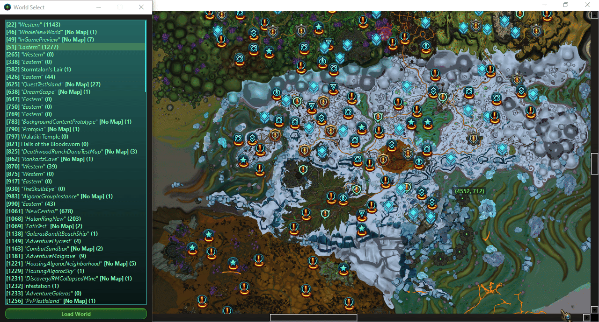
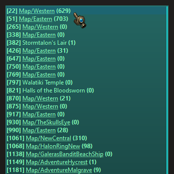
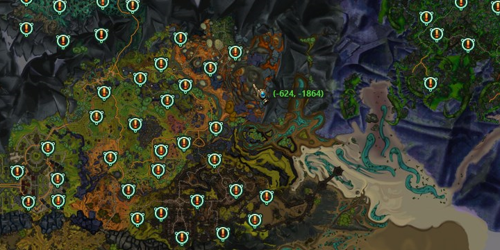
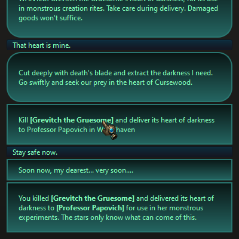

<h1 align="center">Nexus Explorer</h1>


[](https://github.com/charles-masse/NexusExplorer/actions/workflows/test.yml)



Explore the worlds of the defunct MMORPG **WildStar**.

**NexusExplorer** is a tool that allows you to browse extracted minimap, model and world data including dialog not present on [JabbitHole](https://www.jabbithole.com).

## Installation
- You will need the game assets extracted with a tool like [NexusVault](https://github.com/MarbleBag/NexusVault-CLI).
> [!TIP]
> To export everything with NexusVault, point to your game's `Patch/ClientData.archive` with `archive-path PATH_TO_ARCHIVE` and :
```
> search \\
> export
```
- Export at least one language file (e.g.:`en-US.csv` from `Patch/ClientEn.archive`).
- Edit the `settings.json` with the path to the exported assets and the name of the language file you want to use:
```JSON
{
    "gameFiles" : "Nexusvault/output/export",
    "language" : "en-US"
}
```

## How to use NexusExplorer
- Run `run.py`.
- Use the WorldSelect window to choose the world you want to load.


> [!NOTE]
> **[WORLD_ID]** MAP_NAME **(NUMBER_OF_FEATURES)**

- Explore the map features by clicking on the different icons.


> [!TIP]
> By clicking on the minimap, the in-game teleport command for this location will be copied to your clipboard.


> [!TIP]
> You can click on underlined names to have more info on that game object.

## Roadmap
- [x] Display minimap
- [x] Cluster map features
- [x] Show Quests
- [x] Show Challenges
- [x] Show Events
- [X] Show Datacubes
- [X] Show Quest and Event objectives
- [X] Show Path missions
- [X] Show quest/mission objectives on map
- [ ] Linked items
- [ ] Show Episodes/Quest chains
- [ ] Linked NPC/creature models
- [ ] Show Nemesis (?)
- [ ] Communicator messages (?)
